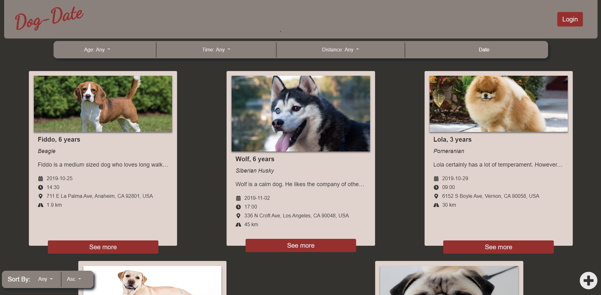

# Dog-Date
> CPSC 349 Project 1
>
> Group: Wallstreet

Dog date is a web application which allows users to plan dog dates with each other and their dogs

Members:
- Abhyuday Vatsavai (Group Leader)
- Ken Tat
- Jenny Reinhard
- Simon Moe Soerensen

#Requirements
- Node.js (>=12.10.x)
- npm (>=6.11.x)
- deployd (>=1.2.x)

#Running the server
To run the server, open a terminal and navigate to dog-date-backend and run the following command 

`dpd ` 

This should start mongoDB. Next navigate to project root and run the following command

`npm start`

This should start the web server. 

You can now connect to the server through a browser. The url is `localhost:3000`

# Front page

